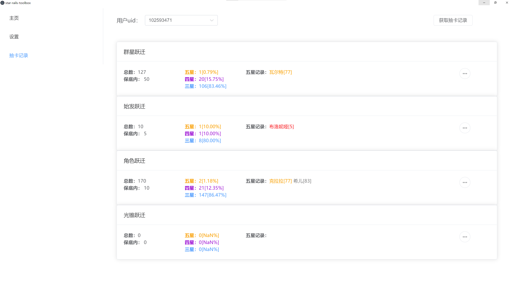
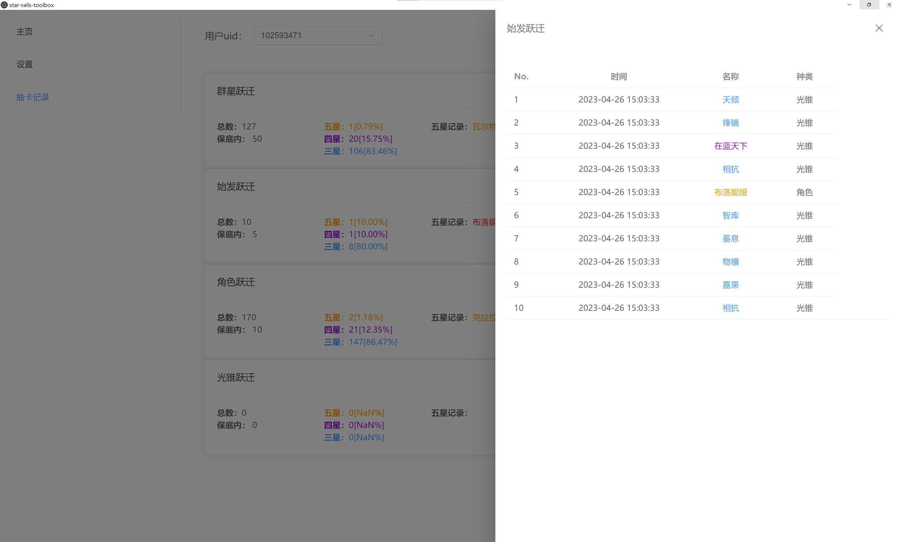

# 星穹铁道工具箱

## 下载

见release

## 使用方法

首次使用先打开一下设置页面，可能会卡一小会，看看游戏路径是否正常获取到，不能的话自己手动填写一下。

然后打开抽卡记录页面，点击获取抽卡记录。

如果显示`用户信息过期`或者`无法获取查询网址`，就打开游戏先去查询一下抽卡记录（用过原神各类工具箱的应该轻车熟路了），然后再次回来获取。

## 来点界面截图
### 抽卡记录页面

### 抽卡的详细记录（点击每种跃迁卡片右边的...）

## ps
作者水平菜，抽卡记录直接以`json`文件的格式写入，~~永远不会~~将来将重构成写入sqlite保存。（又不是不能用）

## 使用技术
* vue3
* electron
* element-plus
